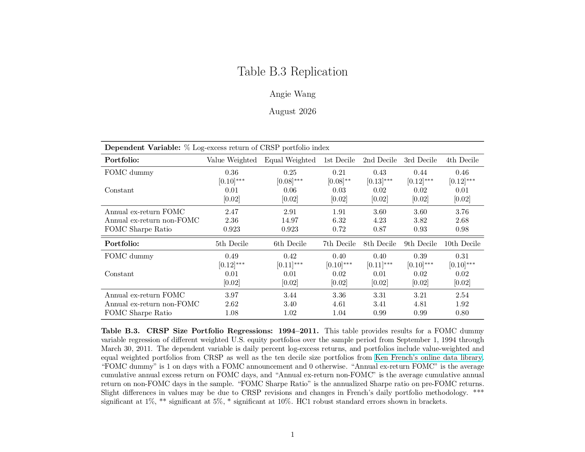

# Pre-FOMC Announcement Returns
Replication of Lucca and Moench (2015).

## Overview
This project replicates Table B.3 of Lucca and Moench (2015), comparing stock portfolio returns on scheduled FOMC announcement days with returns on other trading days. I investigate whether this difference appears across firm-size portfolios and equal- and value-weighted market portfolios. 

## Data and Methods

I use daily Fama-French portfolio returns (publicly available from the Kenneth French Data Library) and CRSP equal and value-weighted portfolio returns (WRDS). For each portfolio, I calculate daily percentage log excess returns to regress on an FOMC announcement-day dummy variable for FOMC meeting dates from September 1994 to March 2011. I estimate each regression by OLS with heteroskedasticity-robust standard errors.

## Results
All regressions yield statistically significant slope estimates at the 5% significance level. For simple dummy regressions such as these, the slope estimate equals the difference between the mean percentage log excess returns for FOMC announcement days and non-FOMC trading days. Likewise, the intercept estimate equals the mean percentage log excess return for the specified portfolio on a non-FOMC announcement day.

## Discussion

Following the methodology detailed in the paper, my replicated results are nearly identical to the ones presented in the original table. 

Across all portfolios in the sample, average log excess returns are significantly higher on FOMC announcement days than on other trading days. This pattern appears across firm-size portfolios and for both equal and value weighted portfolios, suggesting that it is not limited to a single size group or weighting. However, since these portfolios contain overlapping stocks, so each result should not be treated as independent.

These findings are consistent with the paper’s broader evidence of pre-FOMC announcement drift. However, since daily returns include price movements both before and after the FOMC announcement, this analysis cannot identify when within the trading day the higher returns occur.

## References
Lucca, David O., and Emanuel Moench. "The Pre-FOMC Announcement Drift." The Journal of Finance, vol. 70, no. 1, Feb. 2015, pp. 329-71, https://doi.org/10.1111/jofi.12196.

